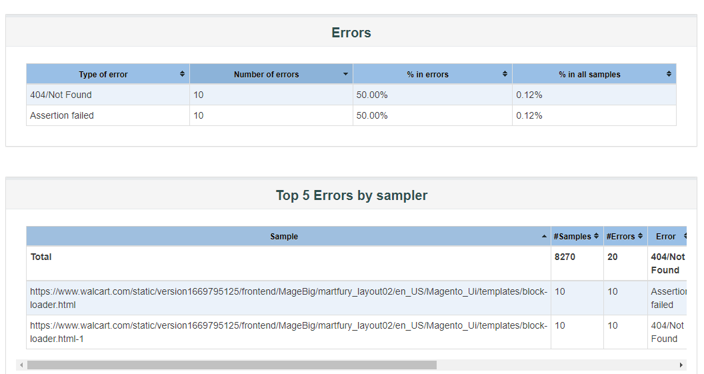

# Content    
- [Introduction](#introduction)
- [Summary](#summary) 
  
    

# Introduction
This document explains how I have done testing lode Time and Response time for a website.

The tasks are done for Registration , Sign In & some other some page .

# Summary 
-------------------------------------------

### Error summary

  

### Report Information

  

### Some Sample of request

  

### Request summary Graph 

  

